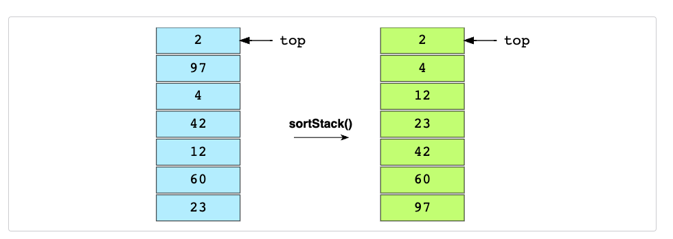

# Push Swap 42 Project

  

## Project Overview

The <strong>Push Swap 42</strong> project is a sorting algorithm challenge designed to enhance problem-solving skills and optimize algorithms. The goal is to sort a stack of integers with a minimal number of operations, using two stacks and a limited set of instructions. This project focuses on algorithm design, optimization, and manipulation of data structures in C.

## Features

<ul>
  <li>Implements two stacks, <code>a</code> and <code>b</code>, for sorting numbers.</li>
  <li>Uses a predefined set of operations: <code>sa</code>, <code>sb</code>, <code>ss</code>, <code>pa</code>, <code>pb</code>, <code>ra</code>, <code>rb</code>, <code>rr</code>, <code>rra</code>, <code>rrb</code>, <code>rrr</code>.</li>
  <li>Efficiently sorts a random sequence of integers with the fewest moves possible.</li>
  <li>Supports handling edge cases such as small or large data sets.</li>
  <li>Implements a checker program to validate if the stack is sorted correctly.</li>
</ul>

## Installation

To install and run this project:

<pre>
git clone https://github.com/mahmoudskhairi/push_swap_42.git
cd push_swap
make
</pre>

## Usage

Here’s an example of how to use the <code>push_swap</code> program:

<pre>
# Example usage
./push_swap 4 67 3 87 23

# To check if the list is sorted
ARG="4 67 3 87 23"; ./push_swap $ARG | ./checker $ARG
</pre>

The <code>push_swap</code> program sorts the numbers, and the <code>checker</code> program confirms if the sorting was done correctly.

<h2 id="contact">Contact</h2>

For any questions, feedback, or issues, feel free to reach out:

<ul>
  <li>Email: <a href="mailto:mahmoud.skhairi@gmail.com">mahmoud.skhairi@gmail.com</a></li>
  <li>LinkedIn: <a href="https://www.linkedin.com/in/mahmoud-skhairi" target="_blank">mahmoud skhairi</a></li>
</ul>

<h2>Happy Coding!</h2>